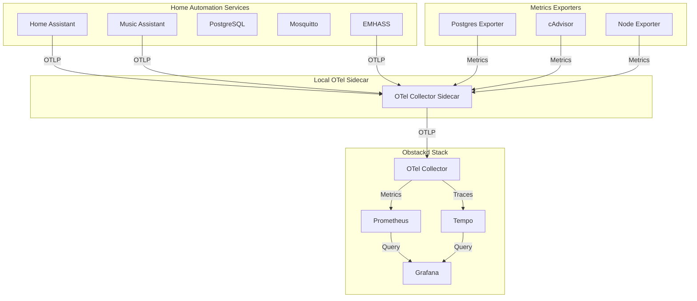
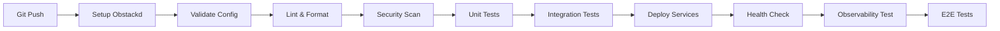

# Smart Home Platform - Enterprise Docker Compose Environment

A production-grade Docker Compose environment for Home Assistant integrated with **Obstackd** - an external, enterprise-ready observability stack providing OpenTelemetry, Prometheus, Tempo, and Grafana.

## Architecture Overview

### Core Services
- **Home Assistant** - Smart home automation platform
- **Music Assistant** - Multi-room audio management
- **PostgreSQL** - Relational database for Home Assistant
- **EMHASS** - Energy management and optimization
- **Mosquitto** - MQTT message broker
- **VS Code** - Web-based code editor

### Observability Stack (via Obstackd)
This project integrates with [Obstackd](https://github.com/paruff/Obstackd) - a GitOps-first, production-ready observability platform:

- **OpenTelemetry Collector** - Vendor-neutral telemetry collection
- **Prometheus** - Metrics storage and querying
- **Tempo** - Distributed tracing backend
- **Grafana** - Unified visualization dashboards
- **Jaeger** - Trace visualization (via Tempo)

**Key Benefits of Obstackd Integration:**
- ✅ Single command deployment
- ✅ Zero manual configuration
- ✅ Production-ready from day one
- ✅ Vendor-neutral observability
- ✅ Complete metrics, traces, and logs

### Local Observability Components
- **OTel Sidecar Collector** - Scrapes app metrics and forwards to Obstackd
- **cAdvisor** - Container metrics
- **Node Exporter** - Host system metrics
- **Postgres Exporter** - Database-specific metrics

### Security & CI/CD
- **Trivy** - Vulnerability scanning
- **Watchtower** - Automatic container updates
- **GitHub Actions** - CI/CD pipeline with SonarCloud integration

## Prerequisites

- Docker 24.0+ with Compose V2
- Git
- Minimum 6GB RAM (4GB for services + 2GB for Obstackd)
- 30GB free disk space
- Linux, macOS, or WSL2 on Windows
- Make (optional but recommended)

## Quick Start

### 1. Clone and Configure

```bash
git clone <repository-url>
cd home-automation
cp .env.example .env
```

### 2. Edit Environment Variables

```bash
nano .env
```

Required variables:
```env
POSTGRES_PASSWORD=your_secure_password
GRAFANA_PASSWORD=your_grafana_password
VSCODE_PASSWORD=your_vscode_password
```

### 3. Deploy Complete Stack (Recommended)

```bash
# Automatically setup Obstackd and start everything
make ci-pipeline
```

This single command will:
1. Clone and setup Obstackd observability stack
2. Start Obstackd services (Prometheus, Tempo, Grafana, OTel Collector)
3. Build and validate home automation services
4. Run security scans and tests
5. Start all services with full observability
6. Verify health checks
7. Test observability pipeline

### Alternative: Manual Setup

```bash
# Setup and start Obstackd
make obstackd-start

# Start home automation services
make up

# Or start without Obstackd
make up-standalone
```

### 4. Access Services

| Service | URL | Default Credentials | Notes |
|---------|-----|---------------------|-------|
| **Grafana** | http://localhost:3000 | admin / admin | From Obstackd |
| **Prometheus** | http://localhost:9090 | None | From Obstackd |
| **Tempo** | http://localhost:3200 | None | From Obstackd |
| Home Assistant | http://localhost:8123 | Configure on first run | |
| VS Code | http://localhost:8443 | (from .env) | |
| Music Assistant | http://localhost:8095 | None | |

## Observability Architecture



### Telemetry Flow

1. **Application Telemetry** → Services emit OTLP metrics/traces to local sidecar
2. **Metrics Scraping** → Sidecar scrapes Prometheus exporters
3. **Forwarding** → Sidecar forwards all telemetry to Obstackd OTel Collector
4. **Storage** → Obstackd stores metrics in Prometheus, traces in Tempo
5. **Visualization** → Grafana provides unified dashboards

## GitOps Workflow

This environment follows GitOps principles with Obstackd integration:

1. **Declarative Configuration** - All infrastructure as code
2. **External Observability** - Obstackd as separate, reusable stack
3. **Version Control** - Git as single source of truth
4. **Automated Deployment** - CI/CD pipelines handle deployment
5. **Continuous Reconciliation** - Drift detection and correction

### Deployment Pipeline with Obstackd



## Obstackd Integration

### Why External Observability Stack?

**Separation of Concerns:**
- Observability stack has different lifecycle than applications
- Can monitor multiple application stacks
- Easier to upgrade/maintain independently
- Follows microservices best practices

**Production Ready:**
- Obstackd is battle-tested and production-ready
- Zero manual configuration required
- Follows GitOps principles
- Vendor-neutral (OpenTelemetry)

### Managing Obstackd

```bash
# Setup Obstackd (first time)
make obstackd-setup

# Start Obstackd stack
make obstackd-start

# Stop Obstackd stack
make obstackd-stop

# View Obstackd logs
make obstackd-logs

# Test Obstackd pipeline
make obstackd-test

# Clean Obstackd completely
make obstackd-clean
```

### Obstackd Health Verification

```bash
# Check OpenTelemetry collector
curl http://localhost:8888/metrics

# Check Prometheus
curl http://localhost:9090/-/healthy

# Check Tempo
curl http://localhost:3200/ready

# Check Grafana
curl http://localhost:3000/api/health

# Or use make command
make otel-health
```

## Testing Strategy

### Test Pyramid with Observability

1. **Unit Tests** - Fast, isolated component tests
2. **Integration Tests** - Service interaction tests
3. **Observability Tests** - Verify telemetry pipeline
4. **E2E Tests** - Full workflow BDD scenarios

### Running Tests

```bash
# All tests including observability
make test

# Individual test suites
make unit-test
make integration-test
make observability-test
make e2e-test

# Test observability pipeline specifically
make obstackd-test
```

### Observability Testing

The platform includes automated tests to verify:
- ✅ OTel Collector receiving metrics
- ✅ Prometheus scraping successfully
- ✅ Grafana datasources configured
- ✅ Traces flowing to Tempo
- ✅ Metrics from home automation services visible

## Security Practices

### Vulnerability Scanning

```bash
# Scan all images
make scan-vulnerabilities

# Supply chain security
make supply-chain-check

# Full security suite
make security
```

### Security Layers

1. **Container Image Scanning** - Trivy checks for CVEs
2. **Configuration Scanning** - IaC security issues
3. **Secret Detection** - TruffleHog for leaked secrets
4. **SBOM Generation** - Software Bill of Materials
5. **Dependency Review** - GitHub dependency scanning

### Health Checks

All services include comprehensive health checks with proper startup periods and retry logic.

## Viewing Observability Data

### Access Dashboards

```bash
# Open Grafana
make dashboard

# Open Prometheus
make metrics

# Open Tempo traces
make traces
```

### Grafana Pre-configured Datasources

Obstackd automatically configures:
- **Prometheus** - For metrics queries
- **Tempo** - For distributed tracing
- **Loki** - For log aggregation (if enabled)

### Example Queries

**Prometheus (Metrics):**
```promql
# Home Assistant uptime
up{job="homeassistant"}

# Container CPU usage
rate(container_cpu_usage_seconds_total[5m])

# Database connections
pg_stat_activity_count
```

**Tempo (Traces):**
- Use Grafana Explore with Tempo datasource
- Search by service name: `homeassistant`, `musicassistant`, `emhass`
- Filter by duration, status, or tags

### Custom Dashboards

Create custom dashboards in Grafana:
1. Navigate to http://localhost:3000
2. Click "+" → "Dashboard"
3. Add panels with Prometheus queries
4. Save and share via JSON

## CI/CD Pipeline

### GitHub Actions Workflow

Automated pipeline with Obstackd integration:

1. **Setup Obstackd** - Clone and start observability stack
2. **Validate** - Config validation
3. **Lint** - Code quality checks
4. **Security Scan** - Vulnerability detection
5. **Supply Chain** - SBOM and dependency review
6. **Unit Tests** - Component testing
7. **Integration Tests** - Service integration
8. **Deploy** - Start services with observability
9. **Observability Test** - Verify telemetry pipeline
10. **E2E Tests** - Full system testing
11. **Code Quality** - SonarCloud analysis (runs in GitHub Actions)

### Local CI Pipeline

```bash
# Run full pipeline locally (includes Obstackd)
make ci-pipeline

# Pre-commit checks
make pre-commit
```

## Backup & Restore

```bash
# Create backup
make backup

# Restore from backup
make restore BACKUP_FILE=backups/postgres_20240108.sql
```

**Note:** Obstackd data is stored separately and can be backed up via:
```bash
cd obstackd
tar czf ../obstackd-backup.tar.gz data/
```

## Troubleshooting

### Obstackd Issues

**Services not starting:**
```bash
cd obstackd
docker compose logs
docker compose ps
```

**Port conflicts:**
Obstackd uses ports 3000, 3200, 4317, 4318, 8888, 8889, 9090. Ensure these are available.

**Reset Obstackd:**
```bash
make obstackd-clean
make obstackd-start
```

### Telemetry Not Flowing

```bash
# Check OTel sidecar
docker compose logs otel_sidecar

# Verify connection to Obstackd
docker compose exec otel_sidecar wget -qO- http://otel-collector:4317

# Check metrics are being scraped
curl http://localhost:8889/metrics
```

### Common Issues

**Services not healthy:**
```bash
make health-check
docker compose logs <service-name>
```

**Database connection issues:**
```bash
make db-shell
```

**MQTT not working:**
```bash
make mqtt-subscribe
docker compose logs mosquitto
```

## Performance Optimization

### Obstackd Tuning

Obstackd is pre-configured for optimal performance. For high-volume environments:

1. Edit `obstackd/config/prometheus/prometheus.yaml` for retention
2. Adjust `obstackd/config/tempo/tempo.yaml` for trace retention
3. Increase Docker resources if needed

### Application Tuning

Configure resource limits in `docker-compose.yml`:
```yaml
deploy:
  resources:
    limits:
      cpus: '2'
      memory: 2G
```

## Best Practices

1. **Separate Observability** - Keep Obstackd running independently
2. **Never commit secrets** - Use .env files (gitignored)
3. **Pin versions** - Avoid `latest` tags in production
4. **Monitor via Grafana** - Use provided dashboards
5. **Regular backups** - Automated daily backups
6. **Security scanning** - Weekly vulnerability scans
7. **Test observability** - Verify telemetry after changes
8. **Update regularly** - Keep Obstackd and services updated

## Makefile Commands

```bash
make help                    # Display all available commands

# Obstackd Management
make obstackd-setup         # Clone and setup Obstackd
make obstackd-start         # Start Obstackd stack
make obstackd-stop          # Stop Obstackd stack
make obstackd-clean         # Remove Obstackd completely
make obstackd-test          # Test observability pipeline

# Service Operations
make up                     # Start all (with Obstackd)
make up-standalone          # Start without Obstackd
make down                   # Stop services
make down-all               # Stop everything including Obstackd
make restart                # Restart all services

# Monitoring & Observability
make dashboard              # Open Grafana
make metrics                # Open Prometheus
make traces                 # Open Tempo traces
make otel-health            # Check OTel collector
make observability-test     # Test telemetry pipeline

# Testing & Security
make test                   # Run all tests
make lint                   # Run linting
make security               # Run security scans
make ci-pipeline            # Full CI/CD pipeline

# Development
make shell                  # Test runner shell
make ha-shell               # Home Assistant CLI
make db-shell               # PostgreSQL shell
make logs                   # View logs
```

## Project Structure

```
home-automation/
├── docker-compose.yml           # Main services definition
├── otel-sidecar-config.yaml     # OTel collector config
├── .env.example                 # Environment variables template
├── Makefile                     # Automation commands
├── obstackd/                    # Obstackd clone (auto-created)
│   ├── compose.yaml
│   ├── config/
│   └── data/
├── tests/
│   ├── unit/
│   ├── integration/
│   ├── e2e/
│   └── features/
├── config/
│   ├── mosquitto.conf
│   └── init-db.sql
└── docs/
    └── README.md
```

## Contributing

1. Fork the repository
2. Create feature branch (`git checkout -b feature/amazing-feature`)
3. Ensure tests pass with observability: `make ci-pipeline`
4. Commit changes (`git commit -m 'Add amazing feature'`)
5. Push to branch (`git push origin feature/amazing-feature`)
6. Open Pull Request

## Resources

- **Obstackd**: https://github.com/paruff/Obstackd
- **OpenTelemetry**: https://opentelemetry.io/
- **Home Assistant**: https://www.home-assistant.io/
- **Grafana**: https://grafana.com/

## License

MIT License - See LICENSE file for details

## Acknowledgments

- **Obstackd** by [@paruff](https://github.com/paruff) - Production-ready observability stack
- Home Assistant Community
- OpenTelemetry Project
- Prometheus & Grafana Teams
- Docker Community
