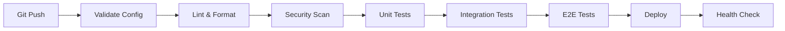

# Smart Home Platform - Enterprise Docker Compose Environment

A production-grade Docker Compose environment for Home Assistant with integrated observability, security scanning, and comprehensive testing.

## Architecture Overview

### Core Services
- **Home Assistant** - Smart home automation platform
- **Music Assistant** - Multi-room audio management
- **PostgreSQL** - Relational database for Home Assistant
- **EMHASS** - Energy management and optimization
- **Mosquitto** - MQTT message broker
- **VS Code** - Web-based code editor

### Observability Stack
- **Prometheus** - Metrics collection and alerting
- **Grafana** - Visualization and dashboards
- **Loki** - Log aggregation
- **Tempo** - Distributed tracing
- **Jaeger** - Trace visualization
- **cAdvisor** - Container metrics
- **Node Exporter** - Host metrics

### Security & CI/CD
- **Trivy** - Vulnerability scanning
- **SonarQube** - Code quality analysis
- **Watchtower** - Automatic container updates
- **GitHub Actions** - CI/CD pipeline

## Prerequisites

- Docker 24.0+ with Compose V2
- Minimum 4GB RAM, 8GB recommended
- 20GB free disk space
- Linux, macOS, or WSL2 on Windows

## Quick Start

### 1. Clone and Configure

```bash
git clone <repository-url>
cd home-automation
cp .env.example .env
```

### 2. Edit Environment Variables

```bash
# Edit .env with your passwords
nano .env
```

Required variables:
```env
POSTGRES_PASSWORD=your_secure_password
GRAFANA_PASSWORD=your_grafana_password
VSCODE_PASSWORD=your_vscode_password
```

### 3. Deploy Stack

```bash
# Full CI/CD pipeline
make ci-pipeline

# Or just start services
make up
```

### 4. Access Services

| Service | URL | Default Credentials |
|---------|-----|---------------------|
| Home Assistant | http://localhost:8123 | Configure on first run |
| Grafana | http://localhost:3000 | admin / (from .env) |
| Prometheus | http://localhost:9090 | None |
| VS Code | http://localhost:8443 | (from .env) |
| SonarQube | http://localhost:9000 | admin / admin |
| Music Assistant | http://localhost:8095 | None |

## GitOps Workflow

This environment follows GitOps principles:

1. **Declarative Configuration** - All infrastructure as code
2. **Version Control** - Git as single source of truth
3. **Automated Deployment** - CI/CD pipelines handle deployment
4. **Continuous Reconciliation** - Drift detection and correction

### Deployment Pipeline



## Testing Strategy

### Test Pyramid

1. **Unit Tests** - Fast, isolated component tests
2. **Integration Tests** - Service interaction tests
3. **E2E Tests** - Full workflow BDD scenarios

### Running Tests

```bash
# All tests
make test

# Individual test suites
make unit-test
make integration-test
make e2e-test

# With coverage
make unit-test  # Generates coverage reports
```

### Test Structure

```
tests/
├── unit/              # Unit tests
│   ├── test_mqtt_connection.py
│   └── test_config_validation.py
├── integration/       # Integration tests
│   ├── test_postgres_integration.py
│   └── test_mqtt_integration.py
├── e2e/              # End-to-end tests
│   ├── test_homeassistant_bdd.py
│   └── test_observability_stack.py
└── features/         # BDD feature files
    └── homeassistant.feature
```

## Security Practices

### Vulnerability Scanning

```bash
# Scan all images
make scan-vulnerabilities

# Supply chain security
make supply-chain-check

# Full security suite
make security
```

### Security Layers

1. **Container Image Scanning** - Trivy checks for CVEs
2. **Configuration Scanning** - IaC security issues
3. **Secret Detection** - TruffleHog for leaked secrets
4. **SBOM Generation** - Software Bill of Materials
5. **Dependency Review** - GitHub dependency scanning

### Health Checks

All services include comprehensive health checks:
- HTTP endpoint checks
- Process verification
- Dependency validation
- Startup period grace time

## Observability

### Metrics

Prometheus scrapes metrics from:
- All containers (cAdvisor)
- Host system (Node Exporter)
- PostgreSQL (Postgres Exporter)
- Home Assistant API
- Custom application metrics

Access Prometheus: http://localhost:9090

### Logs

Structured logging to Loki:
- JSON formatted logs
- Service labels for filtering
- Retention policies
- Query via Grafana

### Traces

Distributed tracing with Tempo:
- OTLP protocol support
- Jaeger-compatible
- Integrated with Grafana

### Dashboards

Pre-configured Grafana dashboards:
- System Overview
- Container Metrics
- Application Performance
- Database Performance
- MQTT Activity

Access Grafana: http://localhost:3000

## CI/CD Pipeline

### GitHub Actions Workflow

Automated pipeline runs on:
- Push to main/develop
- Pull requests
- Weekly security scans

### Pipeline Stages

1. **Validate** - Config validation
2. **Lint** - Code quality checks
3. **Security Scan** - Vulnerability detection
4. **Supply Chain** - SBOM and dependency review
5. **Unit Tests** - Component testing
6. **Integration Tests** - Service integration
7. **E2E Tests** - Full system testing
8. **Code Quality** - SonarQube analysis
9. **Build & Push** - Container registry
10. **Deploy** - Production deployment

### Local CI Pipeline

```bash
# Run full pipeline locally
make ci-pipeline

# Pre-commit checks
make pre-commit
```

## Backup & Restore

### Automated Backups

```bash
# Create backup
make backup

# Restore from backup
make restore BACKUP_FILE=backups/postgres_20240108.sql
```

Backups include:
- PostgreSQL database dump
- Volume snapshots
- Configuration files

### Backup Schedule

Recommended schedule:
- Daily: Database dumps
- Weekly: Full volume backups
- Monthly: Archive to external storage

## Monitoring & Alerts

### Prometheus Alerts

Configure alerts in `alerts.yml`:
- Service down
- High CPU/memory usage
- Database connection issues
- Disk space warnings

### Notification Channels

Supported integrations:
- Slack
- Email
- PagerDuty
- Webhooks

## Development Workflow

### Local Development

```bash
# Start services
make up

# View logs
make logs

# Access shell
make shell

# Home Assistant CLI
make ha-shell

# Database shell
make db-shell
```

### Making Changes

1. Create feature branch
2. Make changes
3. Run pre-commit checks: `make pre-commit`
4. Commit and push
5. Create pull request
6. CI pipeline validates
7. Merge after approval

### Hot Reload

Home Assistant supports configuration reloading:
- Automations: No restart needed
- Scripts: No restart needed
- Full config: Requires restart

## Troubleshooting

### Common Issues

**Services not healthy**
```bash
# Check service status
make health-check

# View logs
docker compose logs <service-name>
```

**Database connection issues**
```bash
# Check PostgreSQL
make db-shell

# Verify credentials
docker compose exec postgres psql -U hauser -d homeassistant
```

**MQTT not working**
```bash
# Subscribe to all topics
make mqtt-subscribe

# Check Mosquitto logs
docker compose logs mosquitto
```

### Debug Mode

Enable debug logging:
```bash
# Edit docker-compose.yml
environment:
  - LOG_LEVEL=debug
```

## Performance Optimization

### Resource Limits

Configure in `docker-compose.yml`:
```yaml
deploy:
  resources:
    limits:
      cpus: '2'
      memory: 2G
    reservations:
      cpus: '1'
      memory: 1G
```

### Database Tuning

PostgreSQL optimization in `init-db.sql`:
- Connection pooling
- Shared buffers
- Work memory
- Checkpoint settings

## Best Practices

1. **Never commit secrets** - Use .env files (gitignored)
2. **Pin versions** - Avoid `latest` tags in production
3. **Monitor resources** - Use Grafana dashboards
4. **Regular backups** - Automated daily backups
5. **Security scanning** - Weekly vulnerability scans
6. **Update regularly** - Apply security patches
7. **Test changes** - Run CI pipeline before deploy
8. **Document changes** - Update README and configs

## Makefile Commands

```bash
make help              # Display all available commands
make build            # Build Docker images
make up               # Start all services
make down             # Stop all services
make restart          # Restart all services
make logs             # Tail service logs
make health-check     # Check service health
make test             # Run all tests
make lint             # Run linting
make security         # Run security scans
make ci-pipeline      # Full CI/CD pipeline
make backup           # Create backup
make restore          # Restore from backup
```

## Contributing

1. Fork the repository
2. Create feature branch (`git checkout -b feature/amazing-feature`)
3. Commit changes (`git commit -m 'Add amazing feature'`)
4. Push to branch (`git push origin feature/amazing-feature`)
5. Open Pull Request

## License

MIT License - See LICENSE file for details

## Support

- Documentation: [docs/](docs/)
- Issues: GitHub Issues
- Discussions: GitHub Discussions

## Acknowledgments

- Home Assistant Community
- Prometheus Project
- Grafana Labs
- Docker Community
